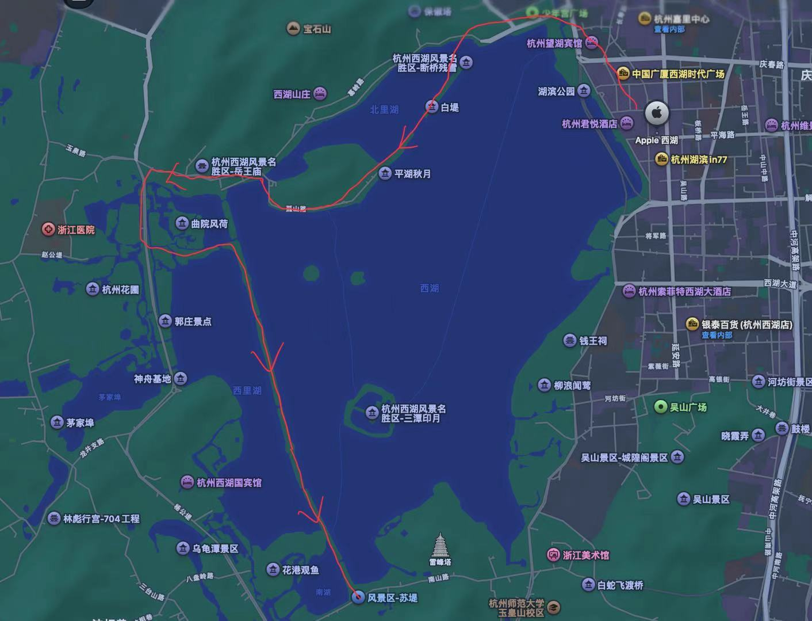
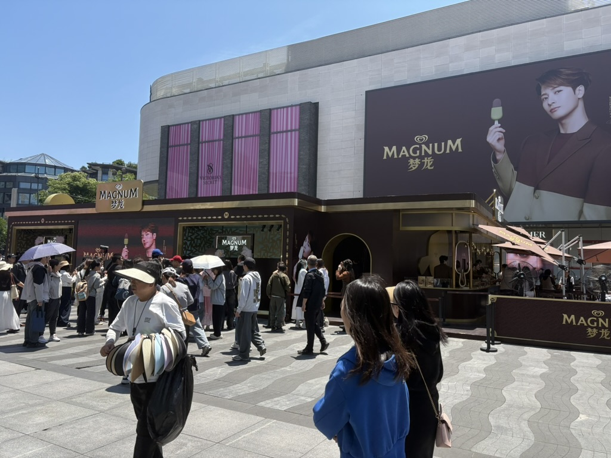
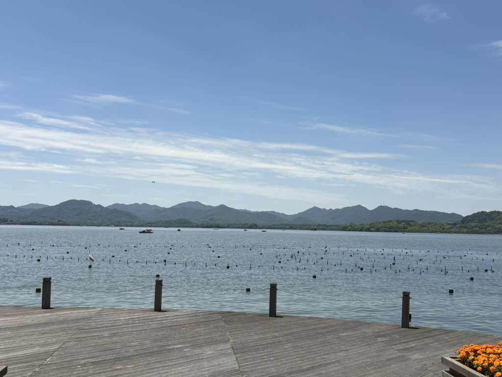
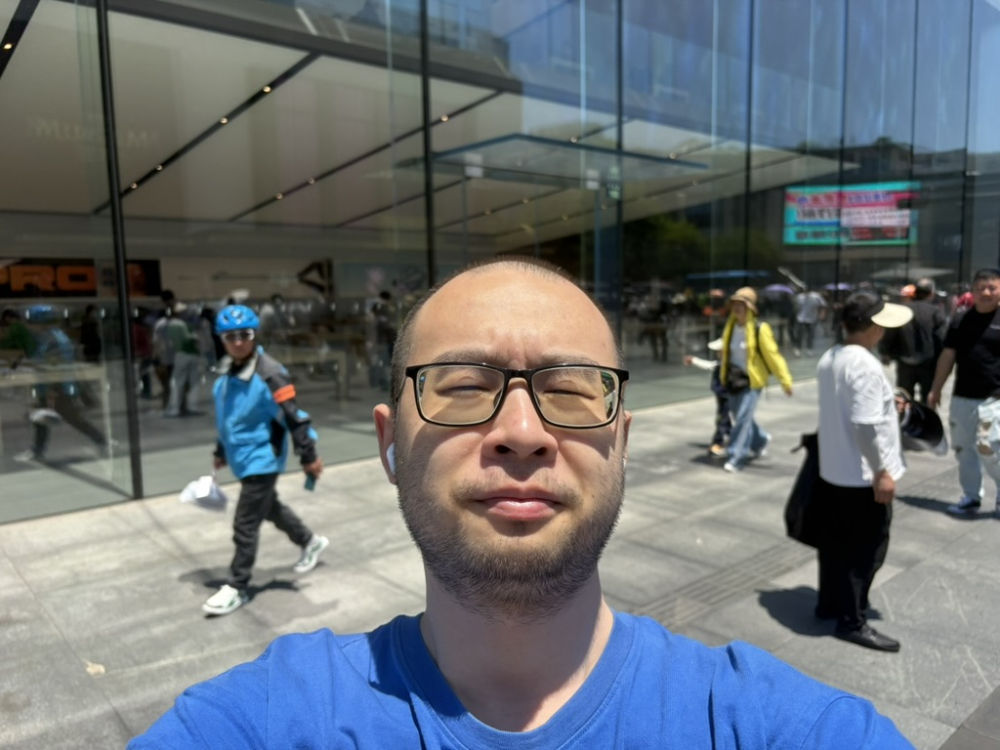
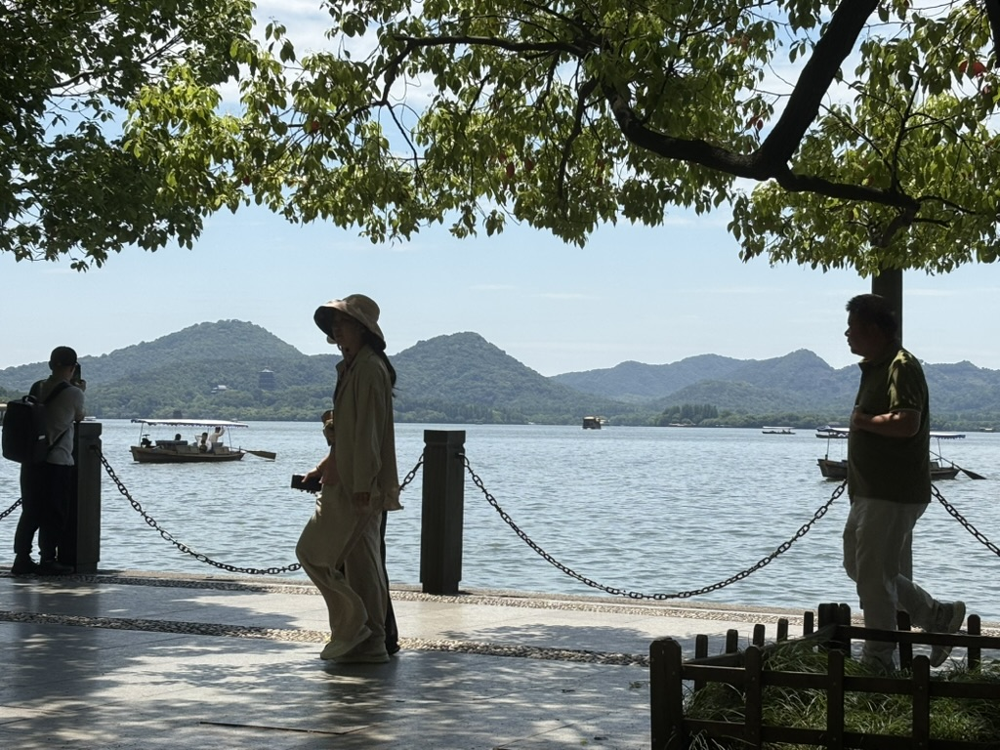
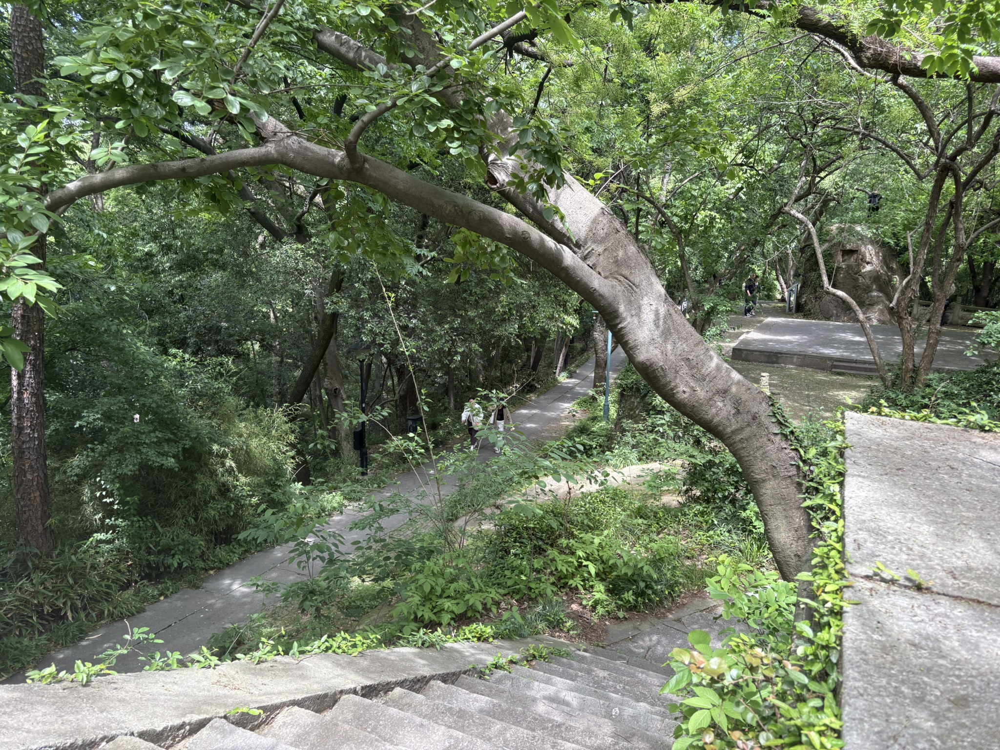
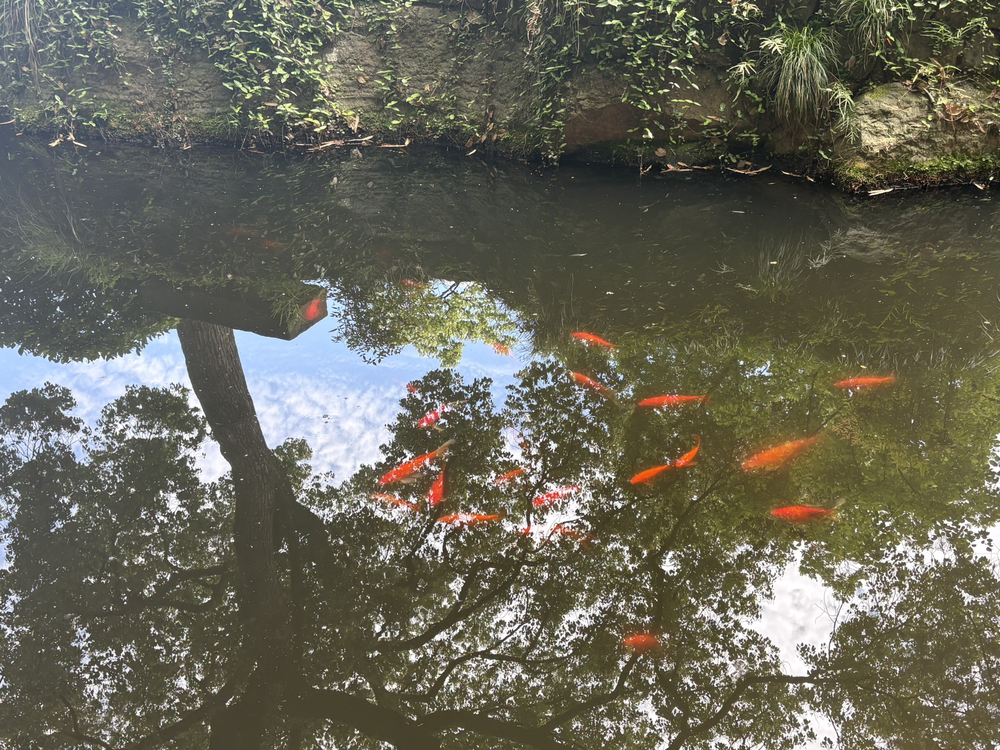
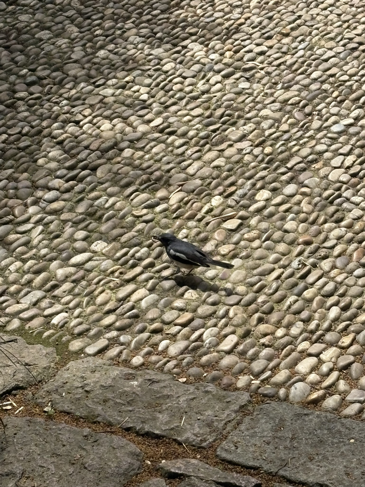

May 9th is my birthday. Today I visited West Lake, and my route as follows:

At the beginning, I started at the Apple Store where I looked at some Apple devices. The weather is so nice that I feel very comfortable and I think today might be the perfect day of the  year to visit West Lake. Later, I walked along the lake and looked at the scenery. 

::: {layout="[[1,1], [1,1]]"}

:::

I remember going to West Lake with a Spanish girl whom I was guiding one evening last October. I needed to use the restroom in the temple I visited today, and she waited for me. That made me feel guilty, because I couldn't properly fulfill my role as her guide during the visit. 

When I reached 中山公园 and recalled that experience, I decided to enter the park again. There is a mountain inside the park, and I climbed it. On the mountain, I found a place called 西泠印社, which was founded by a man who died over a hundred years ago.

Waht impressed me most was a story about him: he once dreamed of his deceased wife. After waking up, he felt deeply sad and decided to carve a seal with her name on it. 

This reminded me of a previous mountain-climbing experience with my classmates, which also left me feeling somewhat sad.

::: {layout="[[1,1], [1]]"}

:::
